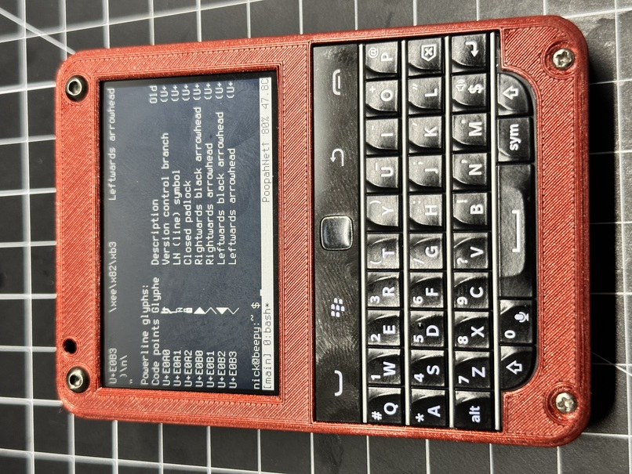

# Beepy Font Hacks



## Switching from Kernel `fbcon` Fonts to User-space Fonts on Beepy


## 1. User-space vs. Kernel Fonts:
- **Kernel Fonts:** Specified with the `fbcon=font:<name>` boot parameter and loaded at boot time.
  
- **User-space Fonts:** Can be loaded and switched dynamically after the Raspberry Pi has booted. There's a lot more fonts available. These are used primary in Linux EGA/VGA console. As it is required for the font to contain exactly 256 or 512 characters and Terminus already used all of them this font files have some glyphs substituted

## 2. Installing User-space Fonts on Beepy:
For Debian-based systems like the Raspberry Pi OS:

```bash
sudo apt-get update
sudo apt-get install console-setup kbd
```

After installation, the fonts will be available in `/usr/share/consolefonts/`.

## 3. Cloning and Using the Powerline Terminus Fonts:
To use the Powerline-enhanced Terminus fonts, follow these steps:

1. Create a directory for your repositories (if you haven't already):

```bash
mkdir -p ~/repos
cd ~/repos
```

2. Clone the required font:

```bash
git clone https://github.com/powerline/fonts.git
```

3. Copy the Terminus fonts to the `consolefonts` directory:

```bash
sudo cp fonts/Terminus/PSF/*.gz /usr/share/consolefonts/
```

4. Apply one of the Powerline Terminus fonts using `setfont`. For example:

```bash
sudo setfont /usr/share/consolefonts/ter-powerline-v12n.psf.gz
```

Normal fonts:
|Filename                     | Rows x Colums               |
|-----------------------------|-----------------------------|
| ter-powerline-v12n.psf.gz | 66x20 |
| ter-powerline-v14n.psf.gz | 50x17 |
| ter-powerline-v16n.psf.gz | 50x15 |
| ter-powerline-v18n.psf.gz | 40x13 |
| ter-powerline-v20n.psf.gz | 40x12 |
| ter-powerline-v22n.psf.gz | 36x10 |
| ter-powerline-v24n.psf.gz | 33x10 |
| ter-powerline-v28n.psf.gz | 28x8  |
| ter-powerline-v32n.psf.gz | 25x7  |

**Bold fonts:**
|Filename                     | Rows x Colums               |
|-----------------------------|-----------------------------|
| ter-powerline-v14b.psf.gz | 50x17 |
| ter-powerline-v16b.psf.gz | 50x15 |
| ter-powerline-v18b.psf.gz | 40x13 |
| ter-powerline-v20b.psf.gz | 40x12 |
| ter-powerline-v22b.psf.gz | 36x10 |
| ter-powerline-v24b.psf.gz | 33x10 |
| ter-powerline-v28b.psf.gz | 28x8  |
| ter-powerline-v32b.psf.gz | 25x7  |


I used this script to cycle fonts and measure size:
```
for font in ter-powerline-v*n*; do sudo setfont $font; sleep 3; echo "| $font | `tput cols`x`tput lines` |"; sleep 1; done
```

---

## Persist the font

To persist a font set by `setfont` across reboots, you'll typically need to configure it at the system level. How you do this depends on the init system and related tools used by your distribution. Since Raspberry Pi often runs distributions based on Debian with the `systemd` init system, I'll explain the method for that:

1. **Persisting the font**:

   - **Debian/Ubuntu (and Raspbian)**:

     Modify `/etc/default/console-setup`. Look for the line starting with `FONT` and change it to:

     ```
     FONT=your-font-name.psf.gz
     ```

     After making this change, you'll need to update your initramfs:

     ```bash
     sudo update-initramfs -u
     ```

2. **Reboot**:

   Finally, to fully test that the change persists across reboots, reboot your Raspberry Pi:

   ```bash
   sudo reboot
   ```

After rebooting, the console should use the font you've specified.
---

## Terminus Font Screenshots


### Size 8x16


### Size 10x20


### Size 12x24


